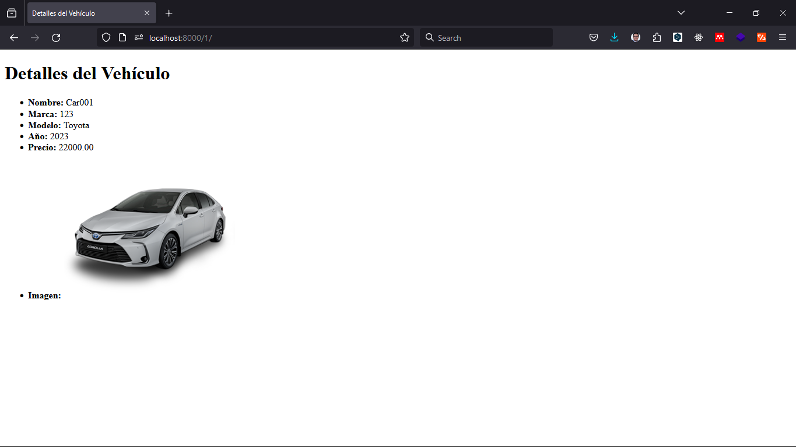

# Tienda Virtual de Vehículos

<div align="center">



</div>

Este proyecto es una tienda virtual de vehículos desarrollada utilizando Django. Permite a los usuarios explorar una variedad de vehículos, ver detalles sobre cada uno de ellos y realizar consultas o compras.

## Características

-   Lista de vehículos disponibles.
-   Detalles de cada vehículo, incluyendo nombre, marca, modelo, año, precio e imagen.
-   Funcionalidad de agregar, editar y eliminar vehículos.
-   Integración con la administración de Django para una gestión fácil de los datos.

## Instalación

1. Clona este repositorio en tu máquina local utilizando Git:

``` bash
git clone https://github.com/tu_usuario/tienda-virtual-vehiculos.git
```
2. Accede al directorio del proyecto:

``` bash
cd tienda-virtual-vehiculos
```
3. Instala las dependencias utilizando pip:

``` bash
pip install -r requirements.txt
```
4. Ejecuta las migraciones para crear las tablas en la base de datos:

``` bash
python manage.py migrate
```
5. Crea un superusuario para acceder a la interfaz de administración:

``` bash
python manage.py createsuperuser
```
7. Inicia el servidor de desarrollo:

``` bash
python manage.py runserver
```
8. Accede a la aplicación en tu navegador web en [http://localhost:8000/](http://localhost:8000/).

# Contribución

¡Las contribuciones son bienvenidas! Si quieres contribuir a este proyecto, por favor sigue las pautas en [CONTRIBUTING.md](CONTRIBUTING.md).

# Licencia

Este proyecto está licenciado bajo la Licencia MIT.

MIT [License](LICENSE)
